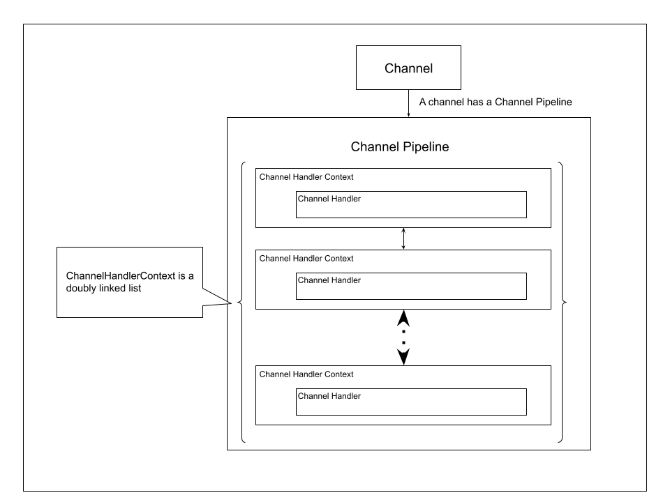

# Channel

채널은 TCP socket과 같이 외부와 데이터를 주고 받는 객체를 추상화한 클래스입니다.
TCP 이외에도 UDP 소켓, unix domain socket 등의 기능을 지원할 수 있습니다.
Channel에서 발생한 이벤트를 처리하기 위해서 el은 ChannelPipeline,
ChannelHandlerContext, Channel Hndler를 사용합니다.

각각의 Channel은 Channel Pipeline을 하나씩 가지고 있습니다.
Channel Pipeline은 Channel Handler들을 관리하며 이벤트가 발생했을 때 Channel Handler의 함수를 호출합니다.
Channel Handler Context는 Channel Pipeline이 Channel Handler 을 관리하기 위해 사용하는 클래스입니다.
Channel Pipeline은 Channel Handler Context의 링크드 리스트를 사용하여 Handler들을 관리합니다.

## 채널 파이프라인

채널은 이벤트가 발생하면 채널 파이프라인에 전달합니다.
채널 파이프라인은 첫 번째 handler부터 차례대로 이벤트 함수를 호출합니다.

채널에 데이터를 쓰는 등의 outgoing event의 경우 반대의 순서로 Channel Handler들이 호출됩니다.

---
이미지 필요.
데이터를 받는 이벤트, 데이터를 쓰는 이벤트에서 어떤 순서로 handler들이 호출되는지 정리하자.
---

## 채널 핸들러

채널 핸들러는 실제로 이벤트가 발생했을 때 호출되는 함수입니다.
한 핸들러에서 여러 이벤트를 처리할 수 있습니다.
request의 파싱, 로깅, 비지니스 로직 코드를 핸들러를 통해 작성할 수 있습니다.

## 채널 핸들러 컨텍스트

채널 핸들러 컨텍스트가 채널 핸들러를 관리하기 위해 사용하는 일종의 wraqpping 클래스입니다.
다음 컨텍스트에 대한 정보, handler가 사용되기 위한 다양한 일을 합니다.
더블 링크드 링크드 리스트 구조로 이전과 다음 handler context를 알고 있습니다.

## 로컬 채널

로컬 채널은 테스트용 채널입니다. 메모리 상에서 client 채널과 서버 채널어 연결되어 서로 데이터를 주고받습니다.
프로덕션에서 쓰는 용도가 아닙니다. el의 기능을 쉽게 테스트하는 용도로 사용합니다.
